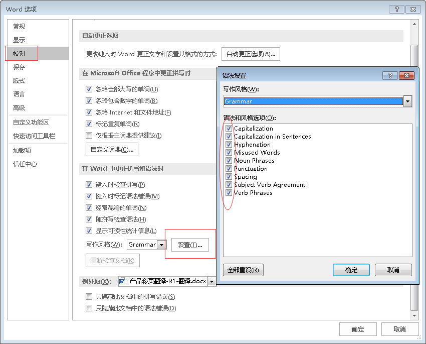

> “...写作者近90%的时间都在与文字打交道...自己写完的文字当时看着挺好的，事后却不得不砍掉大半，甚至全部重来...” Rudolf Fleisch

TW自己写完文档后，若不想直接发出然后收到同行、Developer等潮水般的diss，自检是保证基础质量必不可少的环节。今天就来聊聊文档写完，TW的自检清单。本文适用于英文写作，中文写作请酌情参考。

> **每次文档写作任务，请务必一一对照此份checklist，直至牢记于心。**

## 一阶检查

文档新鲜出炉后，要做的第一件事可不是抑制不住激动的心情，拿去给Developer、其他TW炫耀，而是老老实实、本本分分对照checklist，先自己解决可能的低级错误。

1. 充分利用拼写检查工具，解决拼写错误。如何设置WORD的拼写和语法检查，会在下文中详细讲到。

2. 利用**查找/替换**工具，查找 “‘’” 符号，替换缩略形式为全拼。

   > Example：将“don't”改成“do not”

3. 利用**查找/替换**工具，查找全文“which”，检查是否完全符合 which/that/what/who 的正确使用方法。必要时，调整标点符号、句子结构、替换which，或者直接删除。

4. 利用**查找/替换**工具，全文查找所有的逗号，检查用法。必要时，删除所有逗号，或者调整句子。

5. 利用**查找/替换**工具，全文查找所有的分号，检查用法。必要时，删除所有分号，或者调整句子。

6. 利用**查找/替换**工具，全文查找分隔符，检查用法。

7. 利用**查找/替换**工具，全文查找“, and” “, or” “:”， 即所有的列表项，确保每组列表项为平行结构显示。

## 二阶检查

二阶检查最好是独立的检查每个句子，如果只能做到快速浏览、快速检查，可借助WORD向前或向后查找的功能，修改可能错误。

1. 查找“of”。通常，of会出现在相关的短语中：the \* of, an \* of, a \* of, all of the, 等等。定位所有的of，查看是否有需要完善的表达。
2. 去除不符合技术文档规范的冗余的表达，例如：\* of, time of, total of, in size, in shape, type of, kind of, in order, actually, very 等等。
3. 去除冗余的small words，例如：by，for，of，so，as等。
4. 检查否定句式，尽量使用肯定句式，即去除 not。例如：”Not successful“修改为”unsuccessful“；”Not conclusive“修改为”inconclusive“。
5. 使用通配符，查找表述”the \* of“ 和 ”a \* of”.
6. 再次运行拼写检查工具，确保所有拼写无误。
7. 再次运行WORD的语法检查工具，并找到所有的否定句式。修改并控制全文的否定句数量。一般而言，Memos备忘录文件的否定句数量比例在9%-11%；letter信件中中否定句数量比例在14%-16%。若文档中否定句数量太多，调整部分句子，使整个否定句比例控制在18%-20%。 

8. 查看主要动词形式，例如：Be/Is，Do/Does，Make/Made。
9. 强化其他动词，例如：Perform，Carry out，Conduct，Result in，Obtain，Yield，Give，Furnish，Provide等。
10. 通读全文，确保用词正确。

## 三阶检查

第三阶段检查，主要查看文档是否“漂亮”。例如：页面预览视觉效果如何？有无widow heading，或者缺失的标题？视觉元素（主要指一些图标）位置是否合适？留白是否足够？有无多余的空白页？ 等等。

## 小知识：如何高效设置Microsoft Word的拼写和语法检查工具

## 小建议：如何写“好”文档

1. 保持句子简洁易懂。一个句子不要包含多个中心意思。
2. 保持句子独立、完整，避免碎片化、零散的表达。
3. 不要使用双重否定。
4. 基于事实，避免夸张的表述。
5. 不要滥用逗号。
6. 主、谓永远一致。动词必须服务于主语，搭配恰当。
7. 不要使用感叹号，一个都不要。
8. 有平实词汇选择的情况下，避免fancy的表达。
9. 仔细检查。
10. 避免名词动词化的表达。
11. 尽可能简洁，避免冗余。
